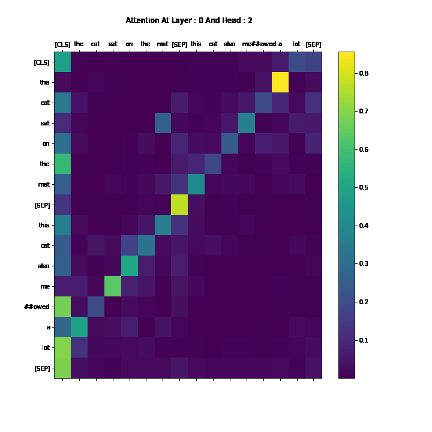

# Attention To Gif

A small library to make gif from Attention Weights collected from various layers of a [Transformer](https://en.wikipedia.org/wiki/Transformer_(machine_learning_model)).




## Setup 
```sh
pip install git+https://github.com/valayDave/attention_to_gif
```

## Examples

[[Example Colab Link](https://colab.research.google.com/drive/1gGiBztUnbuPBW4c_UKle-slx1LojyBYd?usp=sharing)]

### View Video in Jupyter Notebook  

```python
from attention_to_gif to import AttentionVisualizer
from moviepy.editor import VideoClip
# attention_tensor : ( num_layers ,batch_size ,num_heads ,seq_len_x ,seq_len_y )
visulizer = AttentionVisualizer(attention_tensor,x_label_toks=tokens,y_label_toks=tokens,fig_size=(10,10),chosen_head=2)
animation = VideoClip(make_frame=visulizer,duration=visulizer.num_layers) 
animation.ipython_display(fps = 3, loop = False, autoplay = False)
```

### Save Gif : 
```python
from attention_to_gif import AttentionVisualizer
# attention_tensor : ( num_layers ,batch_size ,num_heads ,seq_len_x ,seq_len_y )
visulizer = AttentionVisualizer(attention_tensor,x_label_toks=tokens,y_label_toks=tokens,fig_size=(10,10),chosen_head=2)
visulizer.save_visualisation(viz_name='Attention-Viz.gif',fps = 3)
```
